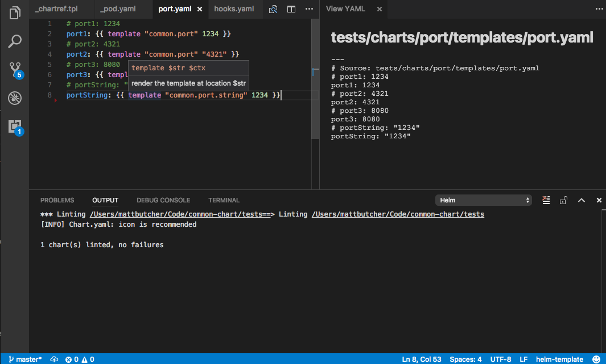

# vscode-helm README

**NOTE:** You should now use the [official Kubernetes Tools extension](https://github.com/Azure/vscode-kubernetes-tools).
It has all of the features of this plugin, plus many more, and will be kept up-to-date.

This Visual Studio Code extension provides [Kubernetes Helm](http://helm.sh) chart developers with a set of tools for creating and testing charts.



## Features

- Syntax highlighting for YAML + Helm Templates
- Autocomplete for Helm, Sprig, and Go Tpl functions
- Help text (on hover) for Helm, Sprig, and Go Tpl functions
- Snippets for quickly scaffolding new charts and templates
- Commands for...
  - **Helm: Lint**: Lint your chart
  - **Helm: Preview Template**: Open a preview window and preview how your template will render
  - **Helm: Template**: Run your chart through the template engine
  - **Helm: DryRun**: Run a `helm install --dry-run --debug` on a remote cluster and get the results
  - **Helm: Version**: Get the Helm version
  - **Helm: Dependency Update**: Update a chart's dependencies.
- Code lenses for:
  - requirements.yaml (Add and update dependencies)
- Right-click on a chart `.tgz` file, and choose `inspect chart` to preview all configurable chart values.

To activate the commands, use `CTRL-SHIFT-P` and begin typing the command name. (On Mac, it's `CMD-SHIFT-P`).

### Experimental Draft Support

Draft is a tool for rapidly creating cloud native applications. Behind the scenes, it use Helm to manage its resources. This extension provides Draft support:

- Commands for...
  - **Draft: Create**: Ceate a new project with Draft
  - **Draft: Up**: Deploy your current application straight out of VS Code

## Requirements

You must have [Helm](http://helm.sh) installed and configured. From there, you should install `helm-template`:

```console
$ helm plugin install https://github.com/technosophos/helm-template
```

It is recommended that you also install `kubectl`, though this extension does not directly use it yet. When `kubectl` is installed, authentication and schema chaching is done automatically for you.

To use **Helm: DryRun** you must have your Kubernetes cluster running Tiller, and `$KUBECONFIG` pointing to that cluster. 

## Extension Settings

* `vscode-helm.exclude`: Do not search the given paths when trying to find a chart.

## Known Issues

- This extension has not been thoroughly tested on Windows.
- For deeply nested charts, template previews are generated against highest (umbrella) chart values (though for Helm Template calls you can pick your chart)

## Release Notes

### 0.1.0

Experimental build.

### 0.2.0

Initial support for Draft, and many bug fixes.

### 0.3.0

Improved support for Kubernetes schema hover tips. Added support for intellisense on `.Values` statements in templates.

The `Helm: Preview Template`  view has changed: It now opens only one preview window, and any active editor that is a template is displayed in that window.

## TODO:

- [ ] Add support for a '.vsc-values.yaml' that will merge with 'values.yaml'
